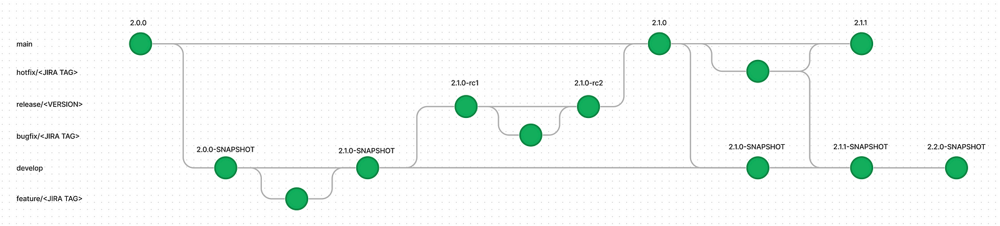
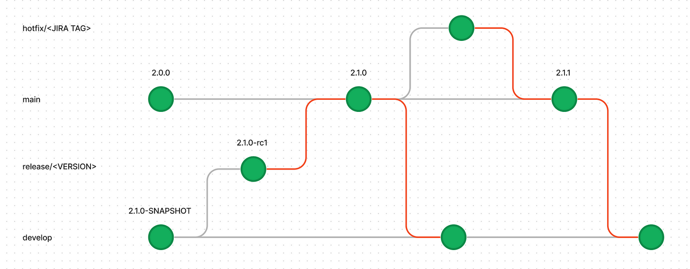
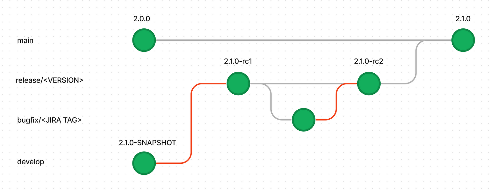
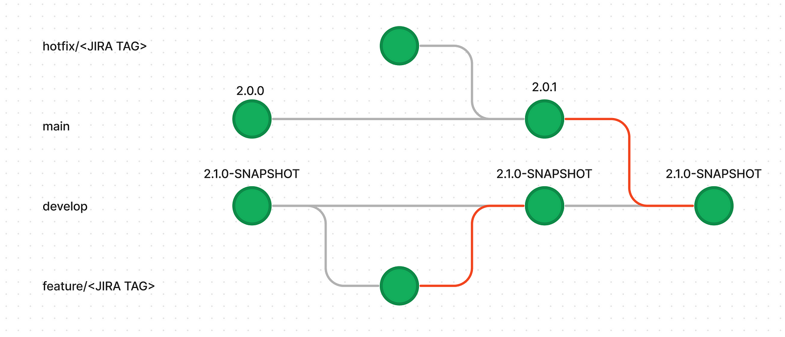
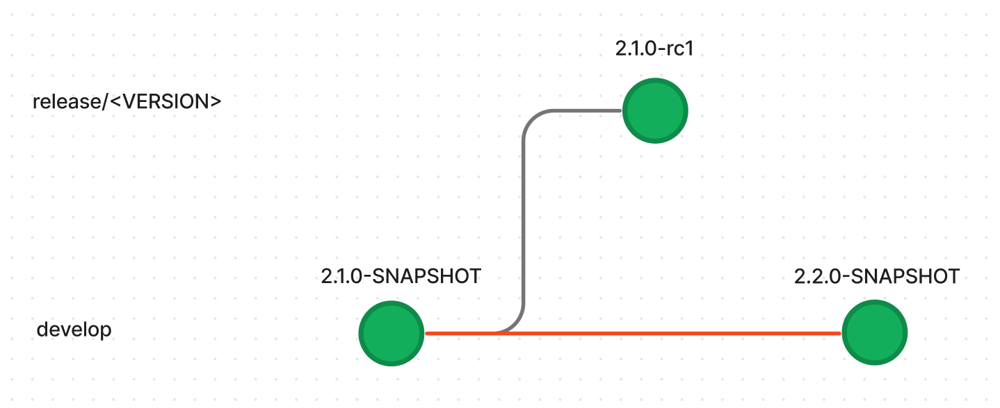
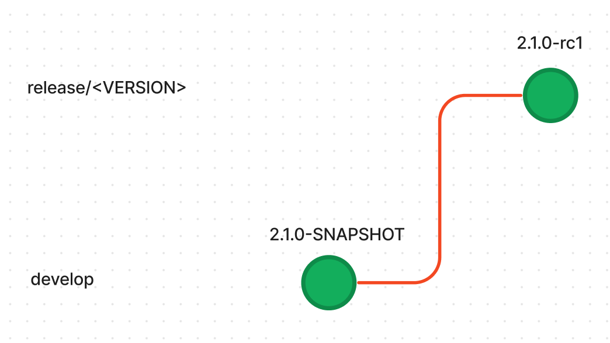

All the code for this article is available on [GitHub](https://github.com/ushiradineth/semver_ci).

---

## Branching Strategy

_GitFlow_

The repository needs to follow the following branching strategy with three main branches:

- develop - Active development branch where new features are implemented. Feature branches are created from the develop branch. Merging a feature branch into develop triggers a snapshot build.
- 'release/\*' - Release branches are broken off of develop branches once the features for the release have been completed. The initial commit to the release branch and every subsequent commit will trigger release candidate builds.
- 'main' - Represents the latest stable release. Production builds are managed here and tags are managed to separate each released version. Hotfixes are broken off and merged to the main branch.

Additionally, we use branches like 'hotfix/\*' and 'bugfix/\*' for addressing issues in main and release branches, respectively, and 'feature/\*' for feature branches as mentioned above. This branching strategy follows the popular and mature GitFlow system.

Reference: [GitFlow](https://www.atlassian.com/git/tutorials/comparing-workflows/gitflow-workflow)

## Semantic Versioning 2.0

In this versioning system, we align with the Semantic Versioning 2.0 (SemVer 2) to ensure clarity and consistency in our application version management. The SemVer structure we follow is MAJOR.MINOR.PATCH.

- Development Version ('develop' branch): During active development in the 'develop' branch, the version is represented as '\<MAJOR>\<MINOR>\<PATCH>-SNAPSHOT'. The 'SNAPSHOT' identifier indicates that this version is a dynamic and continuously evolving state, capturing ongoing changes and additions.
- Release Candidate Version ('release/\*' branch): As we prepare for a release, version numbers on release branches take the form '\<MAJOR>\<MINOR>\<PATCH>-rc\<number>'. The 'rc' (release candidate) identifier is followed by a sequential number (1, 2, etc.), signifying iterations of the release candidate. These versions undergo testing in environments like QA before reaching the final release.
- Staging and Production Version (main branch): Once a release candidate has been thoroughly tested and approved, it progresses to staging and production with a version number of '\<MAJOR>\<MINOR>\<PATCH>'. This signifies a stable and production-ready release, following the principles of SemVer.

By adopting SemVer in our versioning strategy, we enhance communication about our software changes, maintain a clear understanding of version compatibility, and ensure a systematic approach to releases across different stages of our development lifecycle.

Reference: [Semantic Versioning](https://semver.org/)

## Branch Pipelines

These pipelines are triggered when code is pushed to the branch and are responsible of releasing to code to each environment.

_main branch pipeline flow_

'main' branch pipeline flowThe 'main' pipeline is responsible for deploying all code pushed to the 'main' branch. It begins by running the 'version.sh' script, removing any build identifiers (such as 'rc1') from the version. The pipeline then proceeds to update the 'develop' branch with each merged release or hotfix using 'release.sh' and 'hotfix.sh' scripts. Following this, the pipeline tags the release or hotfix and concludes by building the Docker image

File: [semver_ci/bitbucket-pipelines.yml](https://github.com/ushiradineth/semver_ci/blob/main/bitbucket-pipelines.yml)

### 'release/' pipeline

_release/\* branch pipeline flow_

When a new release branch is created using the 'release/\*' pattern, the 'release/\*' pipeline will be triggered. During its initial run, this pipeline dynamically adjusts the version by replacing the 'develop' branch's build identifier 'SNAPSHOT' with 'rc1' using the 'version.sh' script. Subsequent pushes to the release branch trigger the pipeline once again, incrementing the release candidate version on each push. This seamless process ensures that the version in the 'release/\*' branch accurately reflects the evolving release candidates. The pipeline concludes by building the Docker image.

### 'develop' pipeline

_develop/\* branch pipeline flow_

Upon merging code from either the 'feature/\*' or 'main' branches into 'develop', the 'develop' pipeline will be triggered. The 'version.sh' script will first add the SNAPSHOT build identifier to the version (e.g., 2.0.1-SNAPSHOT). Following this version update, the pipeline will build the Docker image.

## Custom Pipelines

### 'version-bump' pipeline

_version-bump pipeline flow_

The 'version-bump' pipeline, using by the 'version.sh' script, handles version increments in the 'develop' branch. Developers can trigger version bumps, choosing between major, minor, or patch increments.

### 'initiate-release-branch' pipeline

_initiate-release-branch pipeline flow_

The 'initiate-release-branch' script automates the creation of release branches from the 'develop' branch. When executed, it checks out a new branch with the 'release/\*' pattern, commits an empty change to trigger a build, and pushes the branch to the remote repository.

## Versioning Scripts

### 'version.sh'

The 'version.sh' script that is used for maintaining the semantic versioning system. It takes two arguments:

#### Release (snapshot, rc, main):

- snapshot: Sets the version to '2.0.0-SNAPSHOT' in the 'develop' branch.
- rc: Increments and sets the release candidate version in release branches (2.0.0-rc1, 2.0.0-rc2, etc.).
- main: Cleans up build tags in the main branch (2.0.0-rc1 to 2.0.0) and creates a Git Tag with the version.

#### Semantic Version (major, minor, patch): Increments the specified segment of the semantic version.

File: [semver_ci/version.sh](https://github.com/ushiradineth/semver_ci/blob/main/version.sh)

### 'release.sh'

The 'release.sh' script is part of the main pipeline. It compares release and develop versions and updates the develop version if needed.

File: [semver_ci/release.sh](https://github.com/ushiradineth/semver_ci/blob/main/release.sh)

### 'hotfix.sh'

The 'hotfix.sh' script is part of the main pipeline. It increments the patch version for hotfixes, updates develop if needed, and commits the changes.

File: [semver_ci/hotfix.sh](https://github.com/ushiradineth/semver_ci/blob/main/hotfix.sh)

### 'initiate-release-branch.sh'

- The 'initiate-release-branch.sh' script creates a release branch from the develop branch.

File: [semver_ci/initiate-release-branch.sh](https://github.com/ushiradineth/semver_ci/blob/main/initiate-release-branch.sh)

## Alternative: GitFlow CLI Tool by NVIE

- [GitFlow](https://github.com/nvie/gitflow) is a collection of Git extensions to provide high-level repository operations for Vincent Driessen's [branching model](http://nvie.com/git-model).
- Highly recommend using this tool for GitFlow workflows that does not need semantic versioning, the configuration shared above are for workflows that require automated semantic versioning.

---

## Conclusion

This article outlines the usage of Semantic Versioning and automating it using shell scripts and Continuous integration Pipelines.

Thanks for reading!
