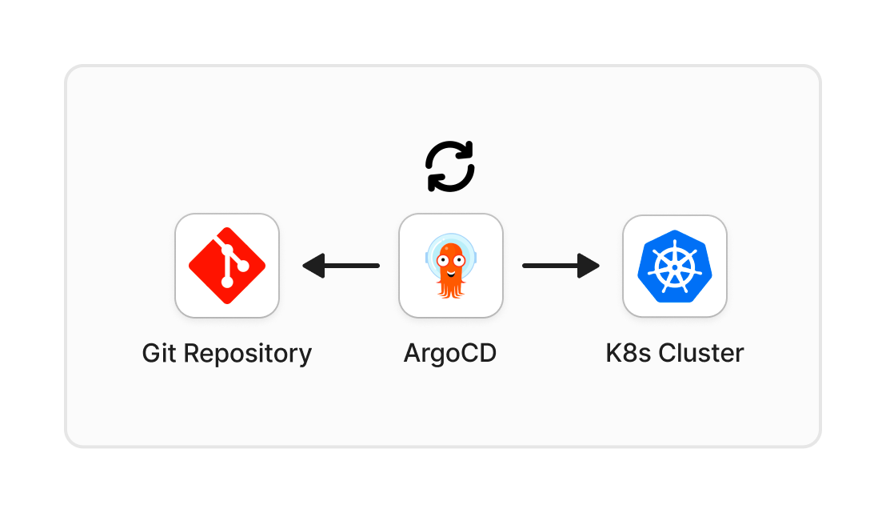

---

## Prerequisites

Before continuing in this article, you should have the following:

- A running Kubernetes cluster with necessary tools and configurations.
- Basic understanding of Git and CI/CD.
- Understanding of [GitFlow](https://www.atlassian.com/git/tutorials/comparing-workflows/gitflow-workflow) would be advantageous.

## GitOps

GitOps is a methodology that leverages [Git](https://git-scm.com/book/en/v2/Getting-Started-What-is-Git%3F) to manage and automate the deployment and configuration of infrastructure and applications. The core idea is to declare the desired state of the system in a Git repository, and a tool, such as [ArgoCD](https://argo-cd.readthedocs.io/en/stable/), continuously reconciles the actual state with the declared state.


_GitOps Flow_

### Key Concepts of GitOps

- **Declarative Configuration**: The desired state of the system, including application configurations and infrastructure definitions, is declared in version controlled repositories.
- **Version Control**: Git repositories serve as the single source of truth for configurations. Every change, whether to the application code, infrastructure, or configurations, is versioned in Git.
- **Automated Synchronization**: Tools like ArgoCD continuously monitor the Git repository for changes. Upon detecting changes, they automatically synchronize the actual state of the system with the declared state in Git.
- **Reconciliation Loop**: The continuous reconciliation loop ensures the deployed system always converges to the desired state declared in the Git repository.


_Reconciliation Loop_

### Strategies of GitOps

GitOps strategies dictate how infrastructure and applications are managed using Git. These strategies, namely, *push* and *pull*, offer different workflows for deployment. In this context, synchronization and governance are essential components ensuring that the desired state in Git repositories aligns with the operational state of target environments.

#### Push Strategy

- Changes are initiated by pushing updates to the Git repository.
- Automated processes detect changes and apply them to the target environment.
- For example, Terraform applies infrastructure changes defined in configuration files stored in a Git repository.


_Terraform Flow_

#### Pull Strategy

- Target environment continuously pulls its desired state from a Git repository.
- Continuous reconciliation ensures the target environment aligns with the desired state.
- For example, ArgoCD monitors Kubernetes manifests stored in a Git repository and automatically applies changes to the target Kubernetes cluster.

#### Comparison

| Push Strategy                                               | Pull Strategy                                                                                         |
| ----------------------------------------------------------- | ----------------------------------------------------------------------------------------------------- |
| Fine-grained control over when changes are applied          | Changes are applied periodically, unless webhooks are configured                                      |
| Simple to implement and understand                          | Comparavely complex architecture                                                                      |
| Immediate feedback on the success or failure of the changes | Feedback is given when changes are periodically applied, with automatic rollback when failed          |
| Desired state and actual state may not always be in-sync    | Ensures the target environment is always in sync with the desired state defined in the Git repository |

## ArgoCD

- [ArgoCD](https://argo-cd.readthedocs.io/en/stable/getting_started/) is an open-source, declarative, GitOps continuous delivery tool designed for Kubernetes. Built on the principles of GitOps, ArgoCD facilitates the automated deployment, monitoring, and management of applications within Kubernetes clusters.
- ArgoCD provides both a web dashboard and a CLI which can be used to manage applications, check synchronization status, and revert to previous states.
- It seamlessly integrates with popular tools like Helm charts and Kustomize, offering flexibility in defining and managing configurations. This adaptability makes ArgoCD a powerful solution for Kubernetes environments, simplifying the usual complexities of application deployment and management.
- ArgoCD configuration data is highly available since it uses Redis as a throw-away cache and all resources are persisted in the Kubernetes’ etcd data store. The Redis cache can be rebuilt without loss of service from etcd. Read more about high availability in ArgoCD [here](https://argo-cd.readthedocs.io/en/stable/operator-manual/high_availability).
- Using a pull-based approach for continuous delivery and GitOps, ArgoCD will observe the Git Repository every three minutes, compare the desired state (Git Repository) to the actual state (Kubernetes Cluster), and then sync any changes if detected. This pull-based model ensures the cluster’s state is always in sync with the declared state in the Git repository, allowing for automated and declarative management of applications and infrastructure.

Here’s how it works:


_ArgoCD Flow_

ArgoCD takes declarative configuration as a core principle, and it achieves this through the use of custom resources like Application and ApplicationSet. These resources allow users to create application configurations in a declarative manner. Check out the sample Application below and for further information, refer to [documentation](https://argo-cd.readthedocs.io/en/stable/operator-manual/declarative-setup/).

### Install ArgoCD Helm Chart

#### Using Helm CLI

```bash
helm repo add argo https://argoproj.github.io/argo-helm
helm install argocd argo/argo-cd
```

#### Using Terraform – REQUIRES HELM PROVIDER

```hcl
resource "helm_release" "argocd" {
  name = "argocd"

  repository       = "https://argoproj.github.io/argo-helm"
  chart            = "argo-cd"
  version          = ""
  namespace        = "argocd"
  create_namespace = true
}
```

### Create ArgoCD Application

You can also apply the Argo Application using `kubectl` or using the `kubernetes_manifest` resource on Terraform.

```yaml
apiVersion: argoproj.io/v1alpha1
kind: Application
metadata:
 name: guestbook
 namespace: argocd
spec:
 project: default
 source:
  repoURL: https://github.com/argoproj/argocd-example-apps.git
  targetRevision: HEAD
  path: guestbook
 destination:
  server: https://kubernetes.default.svc
  namespace: guestbook
 syncPolicy:
  automated:
        prune: true
   selfHeal: true
   allowEmpty: false
  syncOptions:
   - Validate=true
   - CreateNamespace=true
   - PrunePropagationPolicy=foreground
   - PruneLast=true
```

The provided setup will deploy the ArgoCD Example App, utilizing a designated Git Repository with the latest commit on the main branch as the targeted revision. Additionally, a specific application path has been specified, indicating the code that ArgoCD should deploy. Repository credentials can be configured using secrets;a sample configuration is available [here](https://argo-cd.readthedocs.io/en/stable/operator-manual/argocd-repo-creds-yaml/). You can utilize the following annotation to reference the secret.

```yaml
"argocd-image-updater.argoproj.io/write-back-method" = "git:secret:argocd/${local.repo_secret_name}"
```

In addition, the following options are used to ensure precision and control through Sync Policies in ArgoCD:

- Automated Sync:
  - prune: Removes resources from the cluster that are no longer defined in the Git repository.
  - selfHeal: Attempts to bring the cluster state in line with the desired state.
  - allowEmpty: Prevents synchronization if the application source is empty.
- Sync Options:
  - Validate=true: Validates the manifests before applying them to the cluster.
  - PrunePropagationPolicy=foreground: Ensures that pruning occurs in the foreground.
  - CreateNamespace=true: Creates the specified namespace if it doesn’t exist.
  - PruneLast=true: Prunes resources in the last step of synchronization.

## GitOps Workflow with ArgoCD

- Configuration in Git: The DevOps Team commits changes to Git repositories, specifying desired configurations for applications and infrastructure.
- Synchronization: ArgoCD continuously synchronizes the Kubernetes cluster with the Git repository, applying changes and maintaining the desired state.
- Rollback and History: ArgoCD keeps a history of deployments, allowing for easy rollback to previous versions in case of issues or for auditing purposes.

## Argo Image Updater

[Argo Image Updater](https://argocd-image-updater.readthedocs.io/en/stable/) is an extension for ArgoCD that automates the updating of container images in Kubernetes manifests. This tool is vital for maintaining the latest versions of application images and ensuring seamless deployments across environments. Here’s how it works:


_ArgoCD Image Updater Flow_

### Install Argo Image Updater Helm Chart

#### Using Helm CLI

```bash
helm repo add argo https://argoproj.github.io/argo-helm
helm install argocd-image-updater argo/argocd-image-updater -f values.yaml
```

#### Using Terraform – **REQUIRES HELM PROVIDER**

```hcl
resource "helm_release" "argo_image_updater" {
  name = "argo-image-updater"

  repository       = "https://argoproj.github.io/argo-helm"
  chart            = "argocd-image-updater"
  namespace        = "argocd"
  create_namespace = true
  version          = ""

  values = [templatefile(
    "${path.module}/resources/values.yaml",
    {
      AWS_REGION           = var.aws_region
      AWS_ACCOUNT_ID       = var.aws_account_id
      IAM_ROLE_NAME        = aws_iam_role.argo_image_updater_role.name
      BITBUCKET_PUSH_EMAIL = var.bitbucket_push_email
    }
  )]
}
```

### Image updater Values file

– This example uses AWS ECR as the image repository. Make sure to replace the [image repository configuration](https://argocd-image-updater.readthedocs.io/en/stable/configuration/registries/) with the one you use.

```yaml
metrics:
  enabled: true

config:
  registries:
  - name: ECR
    api_url: https://${AWS_ACCOUNT_ID}.dkr.ecr.${AWS_REGION}.amazonaws.com
    prefix: ${AWS_ACCOUNT_ID}.dkr.ecr.${AWS_REGION}.amazonaws.com
    default: true
    ping: yes
    insecure: no
    credentials: ext:/scripts/ecr-login.sh
    credsexpire: 11h

 # Email used to Commit image updates to the GitOps repository
 gitCommitMail: ${BITBUCKET_PUSH_EMAIL}

authScripts
  enabled: true
  scripts:
    ecr-login.sh: |
      #!/bin/sh
      aws ecr --region $AWS_REGION get-authorization-token --output text
--query 'authorizationData[].authorizationToken' | base64 -d

extraEnv:
  - name: AWS_REGION
    value: ${AWS_REGION}

serviceAccount:
  create: true
  annotations:
    eks.amazonaws.com/role-arn:
arn:aws:iam::{AWS_ACCOUNT_ID}:role/{IAM_ROLE_NAME}
```

The following annotations are used to define which value to update in the helm repository. This annotation is defined in the ArgoCD Application resource.

```yaml
apiVersion: argoproj.io/v1alpha1
kind: Application
metadata:
 name: guestbook
 namespace: argocd
 annotations:
  "argocd-image-updater.argoproj.io/image-list":
"=${var.aws_account_id}.dkr.ecr.${var.aws_region}.amazona
ws.com/"
  "argocd-image-updater.argoproj.io/admin-api.helm.image-tag":
".image.tag"
spec:
 ...
```

### Image Update Policies

- In the ArgoCD Application manifest, annotations play a crucial role in defining image update policies through regular expressions, specifically with the `allow-tags` property. These policies, such as `<image>.allow-tags` govern the selection of image tags permitted for deployment in distinct environments. More annotation policies can be found [here](https://argocd-image-updater.readthedocs.io/en/stable/configuration/images/).
- These policies provide a robust mechanism to control and restrict which image tags can be deployed in each environment. For example, in a development instance, the ArgoCD Application might only pull the latest images based on a pattern like `2.X.X.-SNAPSHOT` based on the regular expression provided through an annotation like the following:

```yaml
argocd-image-updater.argoproj.io/.allow-tags: "regexp:2\.\d+\.\d+-SNAPSHOT"
```

- ArgoCD Applications seamlessly incorporate image update policies, using annotations and regular expressions, to regulate the deployment of specific image tags. The power of these policies lies in their environment-specific nature, enabling control over image versions in various environments.

## Summary

GitOps, with tools like ArgoCD, revolutionizes Kubernetes infrastructure management through its declarative approach and automated synchronization, ensuring the actual system state aligns with the desired state defined in Git repositories. ArgoCD’s seamless integration and pull-based model facilitate continuous deployment and management of applications within Kubernetes clusters. With the inclusion of Argo Image Updater, the workflow gains automated image update capabilities, further enhancing deployment efficiency and reliability. Overall, GitOps with ArgoCD offers a streamlined, consistent, and agile solution for Kubernetes operations, driving efficiency and scalability in modern software delivery pipelines.
